
<h1 style="font-family: courier;" align="center">satshakit-M7</h1>

<i>An open source & fabbable STM32F7 microcontroller board.</i>

Premises
--
My personal objective with the development of satshakit-M7 is to bring forward the current possibilities of a Fab Lab to, locally and at cheap price, produce and customize powerful and advanced microcontroller boards, like the ones used in production. Satshakit-M7 is embedding one of the tops chips today available on the market at the time of writing (2018), aiming to represent the state of the art of what you can produce by yourself versus what you can buy. The board was made with a cheap and small milling machine and a traditional soldering station, for a total equipment price of 300€ paid once, if you mind that producing such board will cost you a lot. I personally believe that one day we will (almost) build everything we need in a Fab Lab, and satshakit-M7 wants to be a step further in that direction.

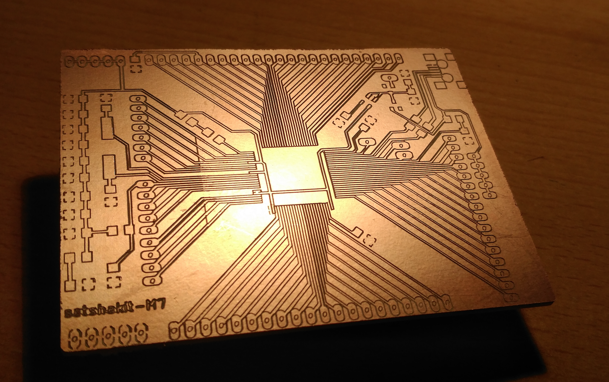

The board
--
satshakit-M7 embeds a **[Cortex M7](https://developer.arm.com/products/processors/cortex-m/cortex-m7)** microcontroller, produced by STMicroelectronics the: **[STM32F765VIT6](http://www.st.com/en/microcontrollers/stm32f765vi.html)**. Among others, the **[STM32F7](http://www.st.com/en/microcontrollers/stm32f7-series.html?querycriteria=productId=SS1858)** chip line and the Cortex-M7 architecture are including the following features:

- **32 bit** architecture
- **6-stage superscalar** pipeline with branch prediction
- dedicated **DSP** instructions
- **hardware acceleration** for graphic computation

satshakit-M7 **schematic**:

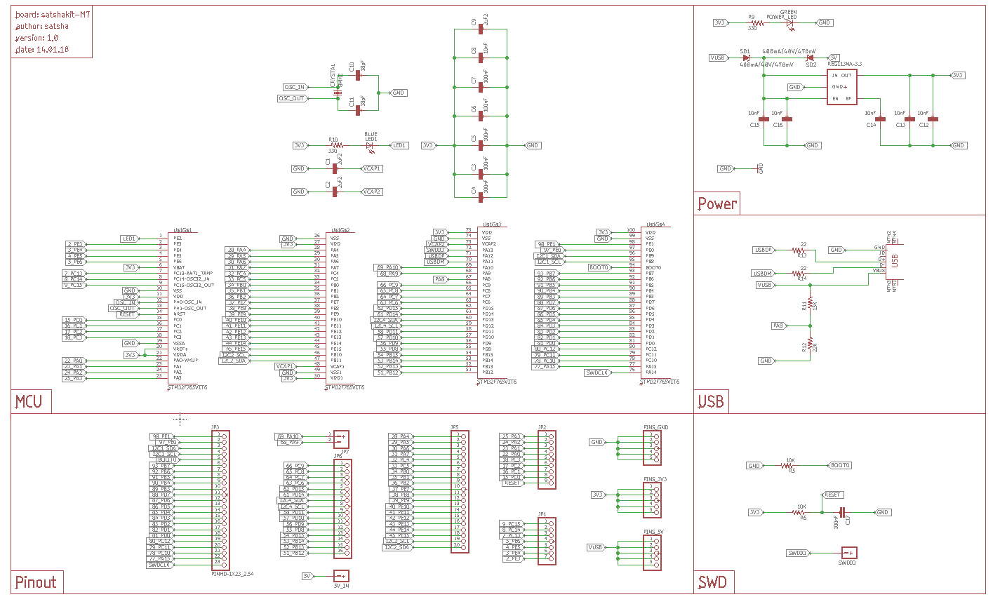

Furthermore, as the STM32 architecture and pinout are quite similar among the different STM32FXX, you could reuse the satshakit-M7 design to host other STM32F microcontrollers. Satshakit-M7 is designed to be one simple, yet complete, PCB to tryout most of the STM32F765VIT6 features and I/O. Apart from the microcontroller itself and few other small parts, the rest is having 1206 components and quite enough space to ensure an easy soldering. 

Here the main **tech specs** of satshakit-M7:

- operating frequency up to **216mhz**
- flash memory of **2MB**
- ram memory of **512KB**
- **QUAD-SPI** memory interface supporting up to 4GB of DDR external ram
- Mini **USB 2.0** full speed support with different modes (DFU,OTG,AUDIO..)
- 3 x **12bit** ADCs
- general purpose **DMA**
- camera interface up to **54MB/s**
- **4** x serials
- **4** x I2C
- **3** x CANs
- **full pinout** on board
- **HDMI-CEC**
- **LCD TFT** controller
- working voltage of **3.3V**
- cost of **21€** (buying from digi-key per single board, way less for more or from China)

satshakit-M7 **board**:

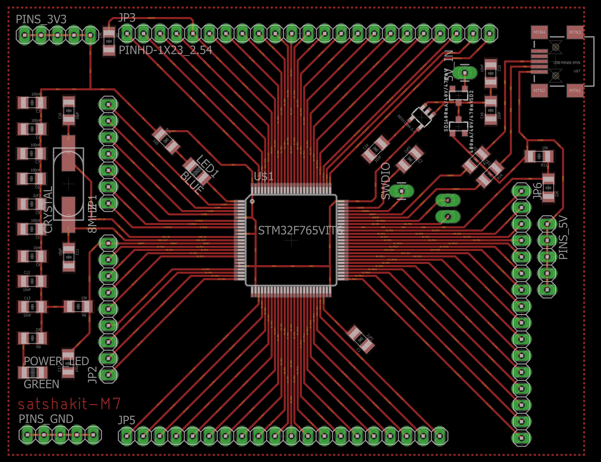

In comparison to the old **[satshakit](https://github.com/satshakit/satshakit)** based on the 328P, satshakit-M7 is several times faster and having much more memory. Here some numbers about it:

- **13.5** times higher operating frequency
- **256** times more ram memory
- **64** times more flash memory
- about **3** times more I/O pins 

Downloads
--

**downloads (right click download as):**

- [satshakit-M7 schematic](https://github.com/satshakit/satshakit-M7/raw/master/eagle/satshakit-M7/satshakit-M7.sch)
- [satshakit-M7 board](https://github.com/satshakit/satshakit-M7/raw/master/eagle/satshakit-M7/satshakit-M7.brd)
- [satshakit-M7 internal traces png](https://github.com/satshakit/satshakit-M7/raw/master/media/satshakit-M7-internal.png)
- [satshakit-M7 cutout png](https://github.com/satshakit/satshakit-M7/raw/master/media/satshakit-M7-cutout.png)
- [satshakit-M7 BOM ods](https://github.com/satshakit/satshakit-M7/raw/master/docs/satshakit-M7-BOM.ods)
- [satshakit-M7 BOM xlsx](https://github.com/satshakit/satshakit-M7/raw/master/docs/satshakit-M7-BOM.xlsx)
- [satshakit-M7 216mhz USB CubeMX example](https://github.com/satshakit/satshakit-M7/raw/master/examples/satshakit-M7-usb-216mhz.zip)
- [satshakit-M7 blink SW4STM32 example](https://github.com/satshakit/satshakit-M7/raw/master/examples/test_blink.zip)

Milling and soldering tips
--

To mill the board a **0.1mm chamfer tool** was used. I recommend to buy several of these as they could warn off  quickly, and they are very easy to be damaged (eg if you drop them). The ones from China usually lasts few cuts, better the one from USA/Europe but of course more expensive.

With such tools you should ensure to have a **flat copper sheet** and therefore also a **flat bed**. In case some parts are not milled properly you can relaunch only a specific areas by cropping subsections of the PNG. To make the board here 2 jobs were necessary. Another solution would be to launch only the job to engrave the traces of the microntroller with the 0.1mm tool, and then launch the rest with a traditional 0.4mm tool (1/64th).

Solder the microntroller by deploying an **huge amount of soldering on the sides** as shown here:

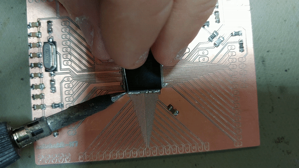

and then by removing it **using a desoldering trace**.

Make sure to **strongly solder the USB connector** to avoid that it will easily detach while connecting and disconnecting the USB cable.

Please make sure that all the **connections are fine** by using the testing function of a multimeter before powering the board. More **patience in testing** will be rewarding is then you have to trash all the board for a mistake. Also, use an **USB hub** for the first smoke test to avoid eventually damage your computer. 

Getting started with satshakit-M7
--

Find below the **satshakit-M7 pinout**:

To have a look to more functionalities associated with each pin please have into the **[STM32F765VIT6 datasheet](http://www.st.com/content/ccc/resource/technical/document/datasheet/group3/c5/37/9c/1d/a6/09/4e/1a/DM00273119/files/DM00273119.pdf/jcr:content/translations/en.DM00273119.pdf)**.

In order to program the satshakit-M7, it is recommended to use a programmer called **ST-Link v2**. You can buy the original on **[digi-key](https://www.digikey.de/product-detail/en/stmicroelectronics/ST-LINK-V2/497-10484-ND/2214535)** or a chinese clone for much less on ebay or on **[Banggood](https://www.digikey.de/product-detail/en/stmicroelectronics/ST-LINK-V2/497-10484-ND/2214535)**.

When you program the satshakit-M7, it is always recommended to:

- connect the **boot pin to the 3.3V VCC** to ensure that the programming pins are not already used for something else
- avoid to power the board from the programmer itself and connect an **external 3.3V power source**

Find here the **connection schema to program** the satshakit-M7:

To program the satshakit-M7 using the ST-Link v2 you download and install the **[STM32 ST-LINK utility ](http://www.st.com/en/development-tools/stsw-link004.html)**, which also installs the ST-Link drivers.

To program the board follow the steps below:

1. connect the satshakit-M7 following the above schema
2. connect the ST-Link to the USB of your PC
3. open the STM32 ST-LINK utility
4. click on target->connect
5. at this point if there's an error the software will warn you, in this case double check the connections and try again
6. if the connection it's ok, click on target->program
7. browse to load you binary file
8. eventually change some options, eg to verify the flash
8. press start
9. wait for the program to be uploaded
10. disconnect the board 
11. remove the boot jumper
12. power again your board

Other useful things can be found in the target menu. Try to **update your ST Link firmware** in ST_LINK->update firmware in case you have other problems in uploading the files. For more info please look at the **[STM32 ST-LINK manual](http://www.st.com/content/ccc/resource/technical/document/user_manual/65/e0/44/72/9e/34/41/8d/DM00026748.pdf/files/DM00026748.pdf/jcr:content/translations/en.DM00026748.pdf)** and the **[ST-LINK Utility manual](http://www.st.com/content/ccc/resource/technical/document/user_manual/e6/10/d8/80/d6/1d/4a/f2/CD00262073.pdf/files/CD00262073.pdf/jcr:content/translations/en.CD00262073.pdf)**.

The STM32F765VIT6 can be easiliy be configured using a graphical tool from ST, the **[STM32CubeMX](http://www.st.com/en/development-tools/stm32cubemx.html)**. Generally this is the first step to understand the main functionalities of the chips, and it's needed to generate the base code of your programs that you can later on use in your IDE. If you wish to use it, I created an **example project in the downloads: [216-USB](examples/satshakit-M7-usb-216mhz.zip)**. which you can use to run the satshakit-M7 at 216mhz and to enable the USB port in VCP mode.

When you generate the base code with STM32CubeMX, you can specify the kind of IDE you will use later to write on top of it your own code. I recommend to use the **[SW4STM32](http://www.openstm32.org/HomePage)** IDE, which is based on eclipse. I added an **example project made with this ide in the downloads: [test-blink](examples/test_blink.zip)**.

Media
--

satshakit-M7 pictures:

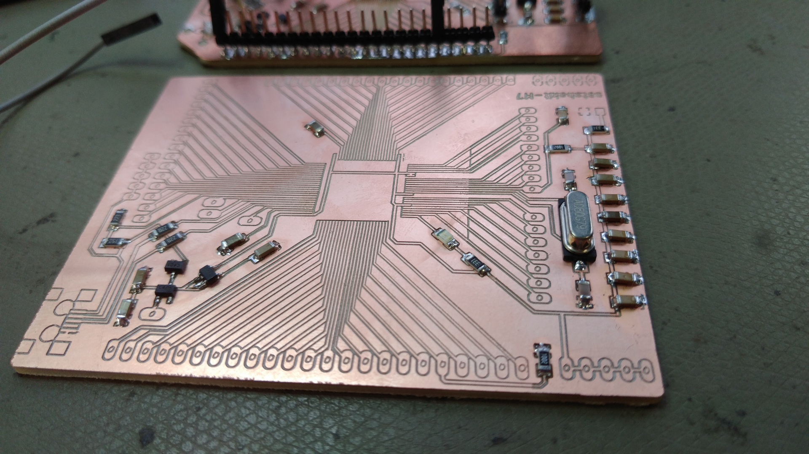
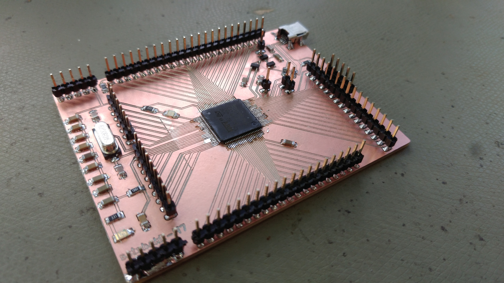
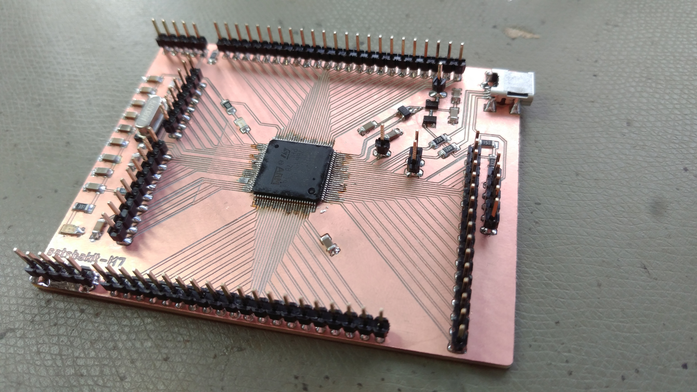

satshakit-M7 connected with the programmer:

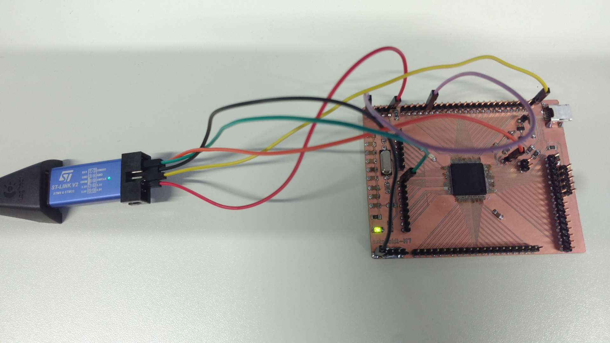

satshakit-M7 with the first prototype:

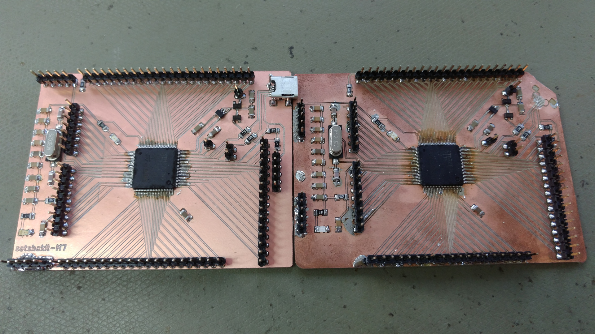

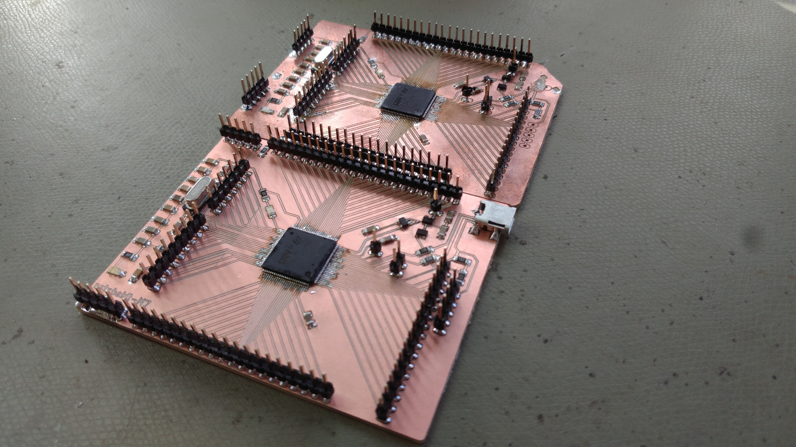

satshakit-M7 blinks:

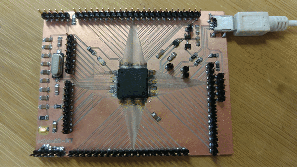

Author
--

- Daniele Ingrassia

Contact
--
- **ingrassiada@gmail.com**
- **[linkedin](http://it.linkedin.com/in/danieleingrassia)**

Thanks
--
[Fablab Kamp-Lintfort](http://fablab.hochschule-rhein-waal.de/index.php/de/) 
Hochschule Rhein-Waal 
Friedrich-Heinrich-Allee 25, 47475 Kamp-Lintfort, Germany 
fablab@hochschule-rhein-waal.de

License
--
This work is licensed under the terms of Attribution-NonCommercial-ShareAlike 4.0 International ([CC BY-NC-SA 4.0](https://creativecommons.org/licenses/by-nc-sa/4.0/)).

Disclaimer  
--

This hardware/software is provided "as is", and you use the hardware/software at your own risk. Under no circumstances shall any author be liable for direct, indirect, special, incidental, or consequential damages resulting from the use, misuse, or inability to use this hardware/software, even if the authors have been advised of the possibility of such damages.

